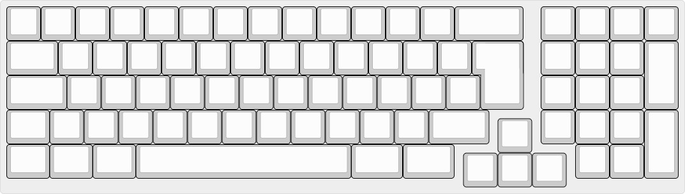

# 1800muente

1800 mini (f-row less) keyboard assembled with mostly through hole components, including usb type-c. ISO and ANSI layouts supported.  
  
  

  
## BOM  
  
| Qty | Item                                          | Notes                                               |
|----:|-----------------------------------------------|-----------------------------------------------------|
|   1 | 1800muente PCB                                |                                                     |
|  81 | Cherry MX compatible switches                 |                                                     |
|   1 | Pro Micro                                     | [aliexpress](https://www.aliexpress.com/item/1847119261.html) |
|  81 | 1N4148 diodes                                 | [LCSC: C261224](https://lcsc.com/product-detail/Metal-Film-Resistor-TH_5-1KR-5102-1_C119195.html)                         |
|   2 | 5.1k resistors            | [LCSC: C119195](https://lcsc.com/product-detail/Metal-Film-Resistor-TH_5-1KR-5102-1_C119195.html)|
|   1 | TYPE-C-31-M-12 USB-C port              | [LCSC: C165948](https://lcsc.com/product-detail/USB-Type-C_Korean-Hroparts-Elec-TYPE-C-31-M-12_C165948.html)|                                                    |
|   1 | Pigtail usb cable                 | Any cheap micro usb cable works|
